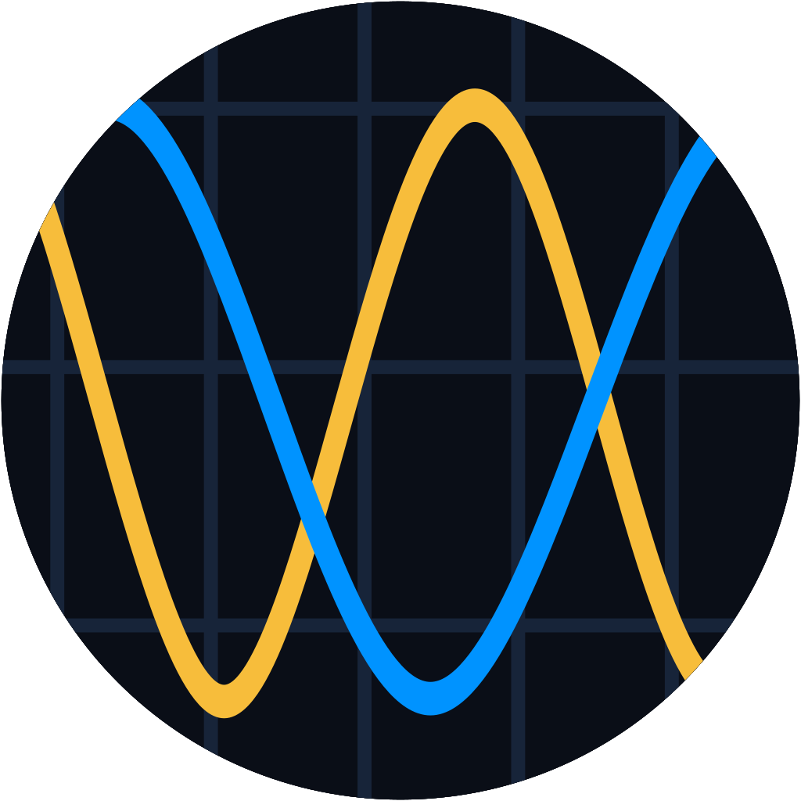
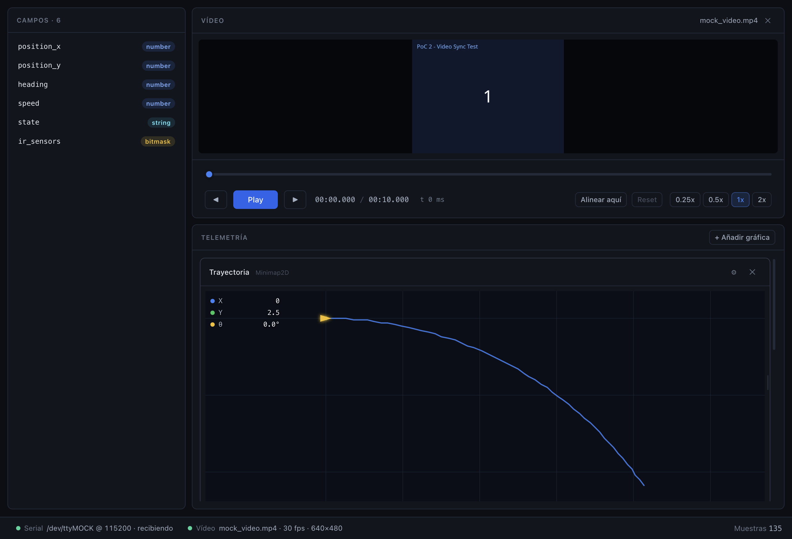
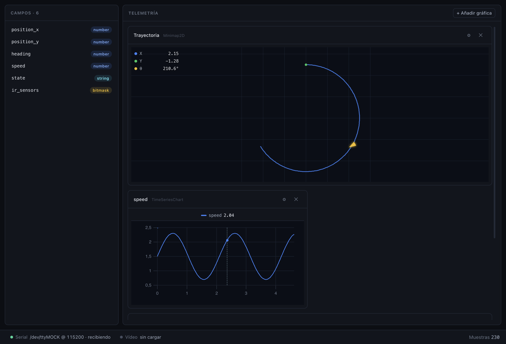
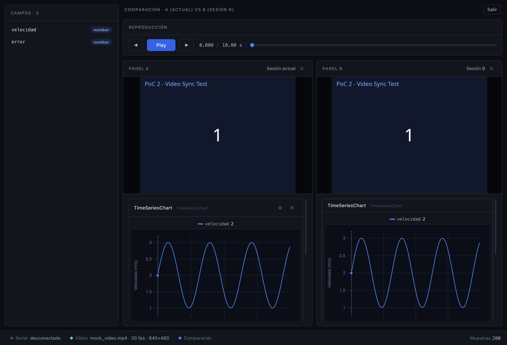
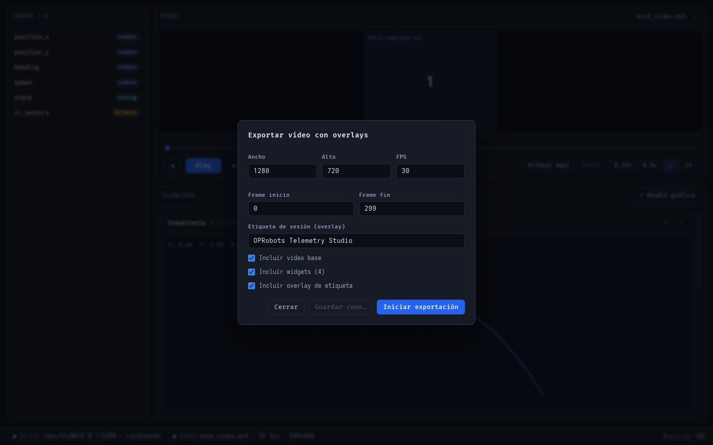
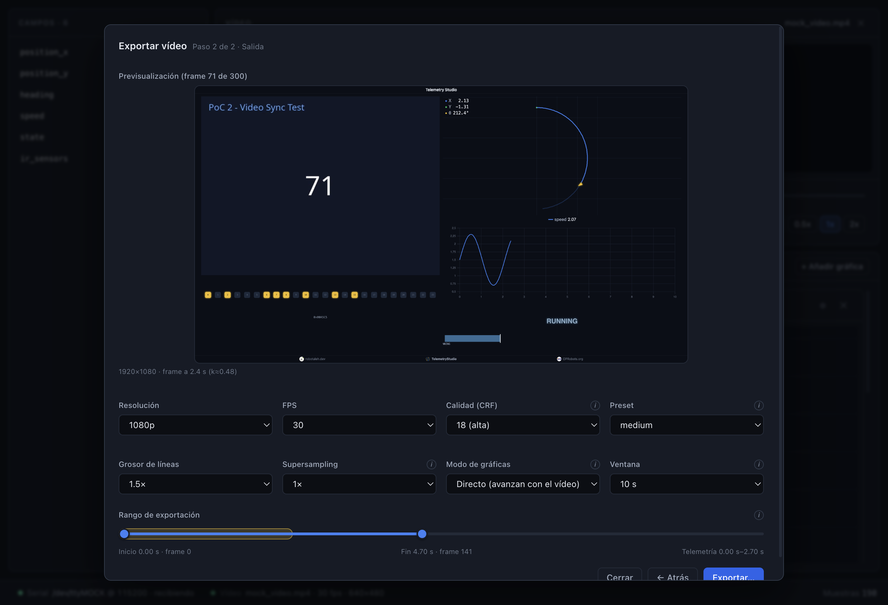
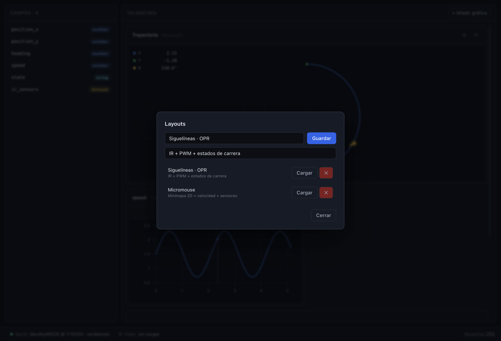
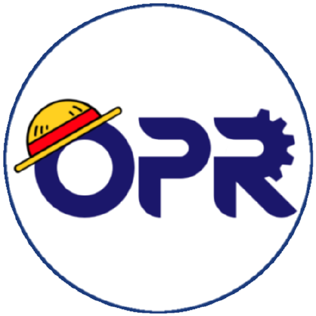
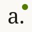
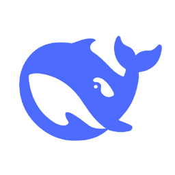

<div align="center">
  
  <h1>Telemetry Studio</h1>
  <p><b>Análisis de telemetría de robots de competición con vídeo sincronizado.</b></p>
  <p>Aplicación de escritorio <b>multiplataforma</b>, <b>100&nbsp;% offline</b> y <b>portable</b>: captura por UART en vivo o abre sesiones guardadas, visualiza los datos en gráficas y widgets, compáralos en paralelo y exporta vídeo con la telemetría superpuesta.</p>
  <p>
    <a href="https://github.com/OPRobots/TelemetryStudio/releases"></a>
    <a href="https://github.com/OPRobots/TelemetryStudio/actions/workflows/ci.yml"></a>
    
    <a href="LICENSE"></a>
  </p>
</div>



## ¿Qué es Telemetry Studio?

Telemetry Studio está pensado para **diagnosticar y depurar robots de competición** (Siguelíneas,
Robotracer, Micromouse, MiniSumo…) a pie de pista. Reproduce el vídeo de la run y muestra la
telemetría **en el instante exacto del vídeo**, todo desde una única app de escritorio sin
dependencias de red.

## Características

- **Vídeo + telemetría sincronizados** — abre un vídeo (`.mp4`, `.webm`, `.mov`, `.mkv`; se
  recomienda `.mp4` H.264) y visualiza cada dato en el frame correspondiente. Los códecs no
  soportados por Chromium (p. ej. **HEVC/H.265**) se **transcodifican a H.264** automáticamente.
- **Serial en vivo** — conéctate por UART y captura los frames durante la reproducción.
  Formatos **Default** (`T:ms,campo:valor`), **CSV** (separador y etiquetas configurables) y
  **Macroarray**. Si la transmisión se reinicia (silencio o `t=0`), la captura se reinicia sola.
- **Widgets por tipo de dato** — numéricos a **gráficas** (uPlot, LTTB), bitmasks a
  **matrices de LEDs**, posiciones a un **minimapa 2D** y estados a una **línea temporal**
  (admiten números o **texto**). El auto-layout los crea según los campos descubiertos.
- **Cursor y zoom compartidos** — al pasar el ratón por una gráfica, el resto de widgets
  saltan a ese instante; el **zoom** (rango) se sincroniza entre todos.
- **Layout configurable** — elige campos, combina series, colores, tamaño y posición.
  Redimensiona y reordena arrastrando, y **guarda layouts con título y descripción**.
- **Sesiones** — guarda `session.json` + copia del vídeo y reábrela con datos, sincronización,
  layout y board de exportación restaurados. El vídeo se coloca en el punto de sincronización.
- **Comparación A/B** — dos sesiones en paralelo (divisor vertical) con reproducción, scroll,
  cursor y zoom sincronizados; exige widgets idénticos.
- **Exportación para redes** — compón un board (vídeo + widgets) y genera un **MP4 H.264** con
  FFmpeg (sidecar), con rango start–end, resolución, FPS, calidad y supersampling ajustables.

## Capturas

**Modo sin vídeo** — la telemetría ocupa toda la ventana.



**Comparación de dos sesiones** en paralelo (reproducción, scroll, cursor y zoom sincronizados).



**Editor de exportación** (paso 1) y **salida** (paso 2, con rango start–end y banda de telemetría).





**Layouts** guardables con título y descripción.



## Descarga

Descarga el instalador para tu sistema desde la página de
[**Releases**](https://github.com/OPRobots/TelemetryStudio/releases/latest):

| Plataforma | Artefacto | Notas |
|---|---|---|
| **Windows** | `...-windows-setup.exe` (recomendado) o `...-windows-portable.exe` | Instalador NSIS o ejecutable portable (sin instalación). |
| **macOS** | `...-macos-arm64.dmg` (Apple Silicon) o `...-macos-x64.dmg` (Intel) | Firma **ad-hoc**, sin notarizar. |
| **Linux** | `...-linux.AppImage` (portable) o `...-linux.deb` | AppImage no requiere instalación. |

> **Aviso:** la app **no está firmada** todavía: Windows (SmartScreen) y macOS (Gatekeeper)
> mostrarán un aviso al abrirla. En macOS puedes abrirla con **clic derecho → Abrir**.

> Funciona **100 % offline** y es **portable**: no requiere permisos de administrador ni conexión.

## Uso rápido

1. **Abrir vídeo** — carga la run (`.mp4` H.264 recomendado; los códecs no soportados se convierten).
2. **Conectar Serial** — puerto, baud y formato de datos; los widgets se auto-crean según los campos.
3. **Analizar** — reproduce el vídeo y las gráficas siguen la reproducción.
4. **Sincronizar** — pausa en el frame que marca el inicio y pulsa **«Alinear aquí»** (ese frame pasa
   a ser `t=0`). El timeline pasa a tiempo relativo; **Reset** lo deshace.
5. **Comparar** — abre una sesión de referencia para verla en paralelo.
6. **Guardar sesión** — crea una carpeta con el `session.json` y el vídeo.
7. **Exportar** (opcional) — monta el board y genera el MP4 para redes.

## Configuración relevante

- **Serial**: baud desde lista estándar; CSV con separador (`/` `,` `;` `\t`) y nombres de columna;
  casilla *"la telemetría incluye timestamp"* (si no, el tiempo es el índice de muestra y la app
  avisa de sync aproximada).
- **Vídeo**: cualquier contenedor soportado por Chromium; la conversión a H.264 se hace sola.
- **Widgets**: campos, colores por serie, `maxPoints` de la gráfica, suavizado, rejilla y tamaño del
  robot, mapa de estados (etiqueta y color), etc.
- **Exportación**: resolución (`720p`/`1080p`/`1440p`/`2160p`), FPS (`30`/`60`), CRF, preset,
  grosor de líneas, supersampling (`1×`/`2×`), modo de gráficas (directo/completo) y rango start–end.
- **Layouts**: guardado con **título + descripción** en `userData/layouts/`.

### Atajos de teclado

| Tecla | Acción |
|---|---|
| `Espacio` | Reproducir / pausar |
| `←` / `→` | Frame anterior / siguiente |
| `+` / `−` | Aumentar / reducir velocidad |
| `Home` / `End` | Ir al inicio / final |

## Probar sin hardware

Con `socat` + el simulador incluido puedes generar telemetría en un puerto virtual. Consulta
[`examples/README.md`](examples/README.md). El **PoC 5** (`pocs/05-telemetry-sender/`) es un
firmware STM32 que envía telemetría de prueba a 100 Hz.

## Desarrollo

```bash
# Requisitos: Node 20+ y npm
npm install
npm run dev      # Electron + HMR
```

| Comando | Descripción |
|---|---|
| `npm run dev` | Desarrollo con HMR (renderer) y hot reload (main). |
| `npm run build` | Build de producción. |
| `npm run typecheck` | Verificación de tipos. |
| `npm run test` | Tests unitarios e integración (Vitest). |
| `npm run lint` | ESLint. |
| `npm run smoke` | Smoke test del renderer. |
| `npm run e2e` | 12 pruebas e2e (serial, vídeo, comparación, export, widgets, layouts…). |
| `npm run e2e:perf` | Medición de rendimiento (standalone). |
| `npm run screenshots` | Regenera las capturas de `docs/assets`. |
| `npm run verify` | Gate completo: lint + typecheck + tests + build + smoke + e2e. |

El empaquetado usa **electron-builder** (`npm run dist:linux`, `dist:mac`, `dist:win`). El
sidecar de FFmpeg se descarga con `scripts/fetch-ffmpeg.mjs`.

## Stack técnico

| Capa | Tecnología | Por qué |
|---|---|---|
| **Runtime** | Electron 34 | Chromium consistente en Windows/macOS/Linux y acceso a módulos nativos. |
| **UI** | React 19 + TypeScript 5.6 (strict) | Componentes como datos y tipado estricto en todo el código. |
| **Estilos** | Tailwind CSS 4 (tokens en CSS vars) | Tema oscuro propio, sin librería de componentes. |
| **Gráficas** | uPlot 1.6 (Canvas 2D) | Miles de puntos a 60 fps; API imperativa encaja con RVFC. |
| **Estado** | Zustand 5 + EventBus / FrameBus | Estado de UI ligero y reparto de frames sin re-render por frame. |
| **Nativos** | serialport 13 (N-API) | UART multiplataforma sin `node-gyp` (prebuilds). |
| **Vídeo** | FFmpeg (sidecar) | Export MP4 y transcodificación a H.264, todo offline. |
| **Build** | electron-vite 2 + electron-builder 25 | HMR en desarrollo y empaquetado para las 3 plataformas. |
| **Tests** | Vitest 3 + harness Electron propio | Unit/integración y 12 pruebas e2e (sin Playwright). |

Arquitectura por capas: `main` (Node), `preload` (contextBridge), `renderer` (React),
`core` (datos y sincronización), `parsers`, `widgets`, `services` y `shared` (puro). El
renderer nunca importa de `main`; la comunicación es solo por IPC. Detalle en
[Arquitectura](docs/01-ARCHITECTURE.md) y [Stack](docs/02-TECH-STACK.md).

## Documentación

La documentación técnica completa vive en [`docs/`](docs/). Empieza por el
[**índice con glosario y recorrido por capas**](docs/README.md).

| Área | Documento |
|---|---|
| Índice, glosario y recorrido | [docs/README.md](docs/README.md) |
| Visión general y flujos de trabajo | [00 · Project overview](docs/00-PROJECT-OVERVIEW.md) |
| Arquitectura, IPC y diagramas | [01 · Architecture](docs/01-ARCHITECTURE.md) |
| Decisiones de stack y versiones | [02 · Tech stack](docs/02-TECH-STACK.md) |
| Estructura de carpetas y dependencias | [03 · Folder structure](docs/03-FOLDER-STRUCTURE.md) |
| Tipos TypeScript, `EventMap` y modelos | [04 · Data model](docs/04-DATA-MODEL.md) |
| Sistema de plugins (parsers y widgets) | [05 · Plugin system](docs/05-PLUGIN-SYSTEM.md) |
| Sincronización vídeo–telemetría | [06 · Video sync](docs/06-VIDEO-SYNC.md) |
| Motor de datos (EventBus, stores…) | [07 · Data engine](docs/07-DATA-ENGINE.md) |
| Widgets y auto-layout | [08 · Widget system](docs/08-WIDGET-SYSTEM.md) |
| Exportación de vídeo | [09 · Video export](docs/09-VIDEO-EXPORT.md) |
| Persistencia de layouts | [10 · Layout manager](docs/10-LAYOUT-MANAGER.md) |
| Empaquetado y CI/CD | [11 · Packaging](docs/11-PACKAGING.md) |
| Limitaciones y workarounds | [12 · Limitations](docs/12-LIMITATIONS.md) |
| Pruebas de concepto | [13 · PoC tests](docs/13-POC-TESTS.md) |
| Formato de sesión (`session.json`) | [14 · Session format](docs/14-SESSION-FORMAT.md) |
| Fases y timeline del proyecto | [ROADMAP.md](ROADMAP.md) |
| Guía para contribuir/agentes | [AGENTS.md](AGENTS.md) |

## Créditos

Desarrollado por **[@robotaleh](https://robotaleh.dev)** con la ayuda de **DeepSeek**, para uso
personal del equipo **OPRobots**.

<table>
  <tr>
    <td align="center" width="33%">
      <a href="https://oprobots.org"><br/>OPRobots</a>
    </td>
    <td align="center" width="33%">
      <a href="https://robotaleh.dev"><br/>robotaleh</a>
    </td>
    <td align="center" width="33%">
      <a href="https://deepseek.com"><br/>DeepSeek</a>
    </td>
  </tr>
</table>

## Licencia

[PolyForm Noncommercial License 1.0.0](LICENSE) — autoría de robotaleh. Se permite el uso
**personal y no comercial**; queda **prohibido el uso comercial**. Texto completo en [`LICENSE`](LICENSE).
