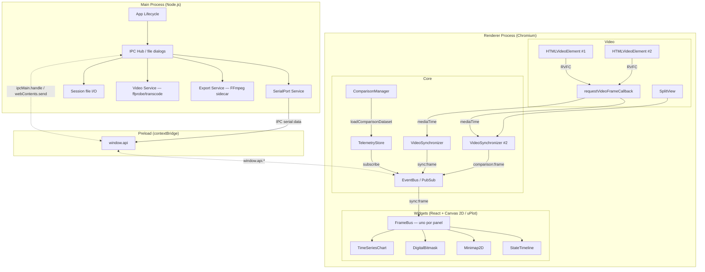

# Arquitectura del Sistema

## Diagrama de Componentes



## Separación de Procesos

### Main Process (Node.js)
- Ciclo de vida de la aplicación (Electron `app`).
- **Servicio de Puerto Serie** (`serialport`) — único lugar donde vive esa dependencia nativa.
- **I/O de sesiones** — leer/escribir `session.json`, resolver la ruta del vídeo hermano
  y listar sesiones. La decodificación/validación del formato vive en el Renderer
  (`services/session-manager.ts` + `core/session-codec.ts`).
- **Servicio de Vídeo** — `ffprobe` (fps) y transcodificación a H.264 cuando el códec no
  es reproducible por Chromium.
- **Servicio de Exportación** — ejecuta **FFmpeg** (sidecar empaquetado o del PATH)
  y recibe los frames como **raw RGBA** por `stdin`.
- IPC Hub: registra los `ipcMain.handle` y el menú nativo; es el puente seguro entre
  Main y Renderer.

### Preload (contextBridge)
- Expone `window.api` (en `src/preload/index.ts`), tipado en
  `src/renderer/src/global.d.ts`: serial, vídeo, sesiones, layouts, exportación, etc.
- Toda llamada del Renderer pasa por aquí; internamente usa `ipcRenderer.invoke` /
  `ipcRenderer.on`. Nunca se expone `ipcRenderer` completo.

### Renderer Process (Chromium)
- Toda la UI (React + Tailwind CSS 4).
- `VideoSynchronizer` con `requestVideoFrameCallback` — hasta 2 instancias en comparación.
- EventBus para eventos de alto nivel; **`FrameBus`** (uno por panel) reparte el frame
  sincronizado a los widgets (`sync:frame` / `comparison:frame`).
- Widgets como **componentes React** (Canvas 2D + uPlot), un set por panel en comparación.
- `ComparisonManager` — valida widgets idénticos y carga el dataset de comparación.
- `SplitView` — vista en paralelo (A izquierda / B derecha) con divisor vertical; crea el
  segundo `VideoSynchronizer` vía `lib/comparison-sync.ts`.
- Composición de frames para exportación en canvas (`lib/export-stage.tsx`, host offscreen).

## Flujo A — Serial + Vídeo (Live)

```
1. Usuario carga vídeo .mp4 (se transcodea a H.264 si hace falta) → HTMLVideoElement
2. Usuario selecciona puerto y baud rate → IPC serial:open
3. Main abre SerialPort + ReadlineParser
4. Cada línea → Main envía IPC 'serial:data' al Renderer
5. Renderer parsea → TelemetryFrame → TelemetryStore + EventBus ('data:streaming-frame')
6. Los widgets se auto-configuran por schema y se redibujan con cada frame
7. Calibración: «Alinear aquí» fija el frame actual del vídeo como t=0 de la telemetría
8. Reproducción: RVFC → mediaTime → búsqueda binaria → frame más cercano
9. Guardar sesión → carpeta con session.json + copia del .mp4
```

## Flujo B — Sesión Guardada (Offline)

```
1. Usuario carga session.json → session-codec decodifica y valida
2. sessionToDataset() convierte el formato compacto a TelemetryDataset
3. Carga el vídeo desde la carpeta del JSON (ruta relativa en session.json)
4. Restaura sync (offset_ms, anchor, rate) y layout de widgets
5. Análisis inmediato sin configuración adicional
```

## Flujo C — Comparación en Paralelo

```
1. Sesión A cargada (Flujo A o B) → TelemetryStore primario
2. Usuario inicia comparación → carga sesión B de referencia
3. ComparisonManager:
   a. Valida que los widgets sean idénticos (tipo, campos, posición, tamaño, config)
   b. Carga el dataset B en TelemetryStore (`loadComparisonDataset`; `clearComparison` al salir)
4. SplitView monta el segundo panel y crea el 2.º VideoSynchronizer
   (`lib/comparison-sync.ts`, eventos `comparison:frame`)
5. UI → SplitView en paralelo (divisor vertical):
   ┌──────────────────┬──────────────────┐
   │ Sesión A (actual)│ Sesión B (comp.) │
   │ Vídeo + Widgets  │ Vídeo + Widgets  │
   └──────────────────┴──────────────────┘
6. Reproducción siempre simétrica (barra compartida guiada por el panel con vídeo)
7. Scroll de widgets sincronizado; cursor (hover) y zoom (rango) compartidos
8. Sin vídeo: placeholder alineado con el panel que sí lo tiene
9. Salir → ComparisonManager.stopComparison()
```

## Flujo de Exportación — Contenido para Redes

```
0. Requiere telemetría cargada (el vídeo es opcional)
1. Usuario abre "Exportar vídeo…": asistente en 2 pasos (layout del board + salida).
   Ajusta resolución, fps, calidad, rango start–end (con banda de telemetría)…
2. IPC export:choose-destination → diálogo nativo de guardado (devuelve outputPath)
3. IPC export:start → Main lanza FFmpeg (raw RGBA por stdin) hacia ese destino
4. Para cada frame del rango (orquestado en services/video-exporter.ts):
   a. ExportStage (host offscreen) compone vídeo + celdas de widgets + overlay
   b. Envía los píxeles RGBA por IPC (export:writeFrame, ArrayBuffer)
   c. Main los escribe en el stdin de FFmpeg con backpressure
5. IPC export:finalize → MP4 H.264 con los gráficos superpuestos
6. El progreso (frames, % y ETA) se calcula y muestra en el renderer (ExportDialog)
```

## Patrón IPC Seguro

La comunicación Main ↔ Renderer **nunca** expone `ipcRenderer` directamente; el Renderer
solo llama a métodos de `window.api`, que el **preload** expone con `contextBridge`. Esto
garantiza `contextIsolation: true`, `nodeIntegration: false` y `sandbox: false`
(necesario por el preload). El Main empuja datos con `webContents.send(channel, data)` y
atiende peticiones con `ipcMain.handle`; el preload las resuelve internamente con
`ipcRenderer.invoke`/`ipcRenderer.on`.
