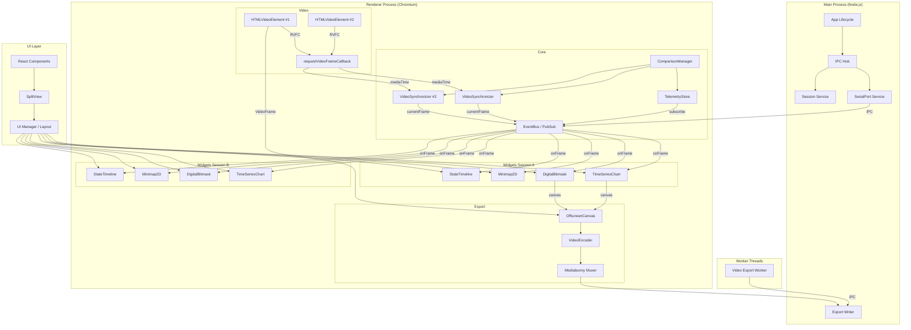

# Arquitectura del Sistema

## Diagrama de Componentes



## Separación de Procesos

### Main Process (Node.js)
Responsabilidades exclusivas del Main Process:
- Gestión del ciclo de vida de la aplicación (Electron `app`)
- Servicio de Puerto Serie (`serialport`) — único lugar donde vive esta dependencia nativa
- Servicio de Sesiones — exportar/importar carpetas `session.json` + `.mp4`
- IPC Hub: puente seguro entre Main y Renderer
- Escritura de archivos de exportación a disco

### Renderer Process (Chromium)
Responsabilidades exclusivas del Renderer:
- Toda la UI (React + Tailwind + shadcn/ui)
- Motor de Sincronización de Vídeo (`requestVideoFrameCallback`) — hasta 2 instancias en comparación
- EventBus / Pub-Sub para distribución de frames a widgets
- Renderizado de widgets (Canvas 2D + uPlot) — 2 sets en comparación
- ComparisonManager — gestiona 2 contextos de sesión simultáneos
- SplitView — duplica la interfaz verticalmente para comparación
- Captura de frames para exportación (OffscreenCanvas + VideoEncoder)

### Worker Threads
Tareas pesadas delegadas a Workers para no bloquear la UI:
- **Video Export Worker**: Renderiza composición frame-a-frame con OffscreenCanvas

## Flujo A — Serial + Vídeo (Live)

```
1. Usuario carga vídeo .mp4 → HTMLVideoElement carga archivo local
2. Usuario selecciona puerto y baud rate → IPC 'serial:start'
3. Main Process abre SerialPort + ReadlineParser
4. Cada línea recibida → Main envía IPC 'serial:data' al Renderer
5. Renderer parsea línea → genera TelemetryFrame → añade al buffer temporal
6. Streaming continúa hasta que el usuario pulse "Stop"
7. Al detener: buffer completo → TelemetryStore recibe todos los frames
8. EventBus emite 'data:loaded' con schema completo (nombres de campos disponibles)
9. Usuario configura widgets usando los nombres de campos:
   - Agrupa parámetros en gráficas (ej: target_speed + ideal_speed + measured_speed)
   - Selecciona tipo de widget para cada campo o grupo
10. Calibración de sync:
    - Usuario marca un punto en el vídeo (frame N)
    - Usuario indica el timestamp del serial en ese punto
    - Se establece anchor point → VideoSynchronizer calcula drift
11. Sincronización activa:
    - RVFC callback → mediaTime (PTS)
    - Binary search O(log N) → TelemetryFrame más cercano
    - EventBus emite 'frame:current' → widgets se redibujan
    - Barra vertical sincronizada al milisegundo
```

## Flujo B — Sesión Guardada (Offline)

```
1. Usuario carga session.json → session-codec decodifica y valida
2. sessionToDataset() convierte formato compacto a TelemetryDataset
3. Carga vídeo desde la misma carpeta del JSON (ruta relativa en session.json)
4. Restaura sync config (offset_ms, anchor, rate)
5. Restaura layout de widgets (tipos, campos, posiciones, configuraciones)
6. Análisis inmediato sin configuración adicional
```

## Flujo C — Comparación Side-by-Side

```
1. Sesión A cargada (Flujo A o B) → TelemetryStore primario
2. Usuario inicia comparación → carga sesión B
3. ComparisonManager:
   a. Valida que layouts de widgets sean idénticos
      - Si difieren → error con lista de diferencias (tipos, campos, posiciones)
   b. Crea segundo TelemetryDataset (dataset B) en TelemetryStore
   c. Carga segundo vídeo en HTMLVideoElement #2
   d. Crea segundo VideoSynchronizer para vídeo B
   e. Clona widgets de sesión A para sesión B (mismos tipos, campos, configs)
4. UI → SplitView duplica el panel verticalmente:
   ┌─────────────────────────────────┐
   │  Sesión A: VideoPlayer + Widgets │
   ├─────────────────────────────────┤
   │  Sesión B: VideoPlayer + Widgets │
   └─────────────────────────────────┘
5. Ambos synchronizers corren independientemente
6. Barra vertical compartida por defecto:
   - Mover la barra en A → se mueve también en B
   - Toggle "Sync" → permite mover cada barra independientemente
7. Comparación finalizada → ComparisonManager.clear()
```

## Flujo de Exportación — Contenido para Redes Sociales

```
1. Usuario hace clic en "Export for Social Media"
2. Renderer envía IPC 'export:start' con config (fps, codec, resolución)
3. Export Worker crea OffscreenCanvas del tamaño deseado
4. Para cada frame del rango seleccionado:
   a. Worker solicita render de cada widget activo al Canvas
   b. Worker captura video frame base del HTMLVideoElement
   c. Composición en OffscreenCanvas (widgets + vídeo base + overlays)
   d. VideoEncoder codifica frame (VP9/H.264)
   e. Mediabunny muxer escribe chunk al archivo
   f. Progress IPC → Renderer muestra barra de progreso
5. Finalización: flush encoder → finalize muxer → archivo MP4/WebM
6. Resultado: vídeo con gráficos superpuestos para compartir en redes sociales
```

## Patrón IPC Seguro

La comunicación Main ↔ Renderer **nunca** expone `ipcRenderer` directamente. Siempre a través de `contextBridge`:

```
Renderer → ipcRenderer.invoke(channel, ...args) → Main Process
Main Process → ipcMain.handle(channel, handler)
Main Process → mainWindow.webContents.send(channel, data) → Renderer
Renderer → ipcRenderer.on(channel, handler)
```

Esto garantiza `contextIsolation: true` y `nodeIntegration: false`.
