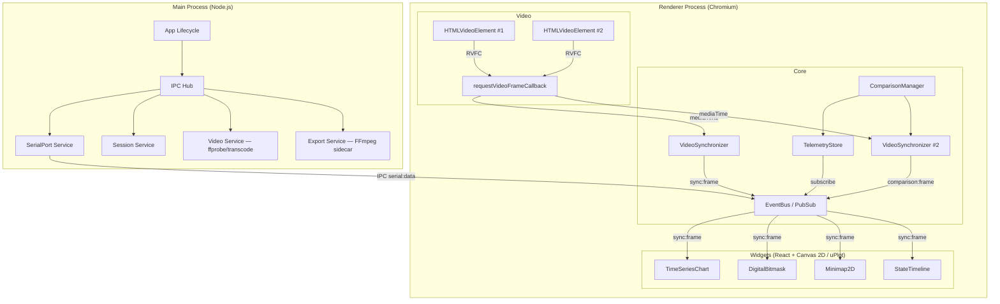

# Arquitectura del Sistema

## Diagrama de Componentes



## Separación de Procesos

### Main Process (Node.js)
- Ciclo de vida de la aplicación (Electron `app`).
- **Servicio de Puerto Serie** (`serialport`) — único lugar donde vive esa dependencia nativa.
- **Servicio de Sesiones** — exportar/importar carpetas con `session.json` + `.mp4`.
- **Servicio de Vídeo** — `ffprobe` (fps) y transcodificación a H.264 cuando el códec no
  es reproducible por Chromium.
- **Servicio de Exportación** — ejecuta **FFmpeg** (sidecar empaquetado o del PATH)
  y recibe los frames como **raw RGBA** por `stdin`.
- IPC Hub: puente seguro entre Main y Renderer.

### Renderer Process (Chromium)
- Toda la UI (React + Tailwind CSS 4).
- `VideoSynchronizer` con `requestVideoFrameCallback` — hasta 2 instancias en comparación.
- EventBus para distribuir los frames a los widgets (`sync:frame` / `comparison:frame`).
- Widgets como **componentes React** (Canvas 2D + uPlot), un set por panel en comparación.
- `ComparisonManager` — valida widgets idénticos y gestiona el dataset de comparación.
- `SplitView` — vista en paralelo (A izquierda / B derecha) con divisor vertical.
- Composición de frames para exportación en canvas (se envían a Main por IPC).

## Flujo A — Serial + Vídeo (Live)

```
1. Usuario carga vídeo .mp4 (se transcodea a H.264 si hace falta) → HTMLVideoElement
2. Usuario selecciona puerto y baud rate → IPC serial:open
3. Main abre SerialPort + ReadlineParser
4. Cada línea → Main envía IPC 'serial:data' al Renderer
5. Renderer parsea → TelemetryFrame → TelemetryStore + EventBus ('data:streaming-frame')
6. Los widgets se auto-configuran por schema y se redibujan con cada frame
7. Calibración: «Alinear aquí» fija el frame actual del vídeo como t=0 de la telemetría
8. Reproducción: RVFC → mediaTime → búsqueda binaria → frame más cercano
9. Guardar sesión → carpeta con session.json + copia del .mp4
```

## Flujo B — Sesión Guardada (Offline)

```
1. Usuario carga session.json → session-codec decodifica y valida
2. sessionToDataset() convierte el formato compacto a TelemetryDataset
3. Carga el vídeo desde la carpeta del JSON (ruta relativa en session.json)
4. Restaura sync (offset_ms, anchor, rate) y layout de widgets
5. Análisis inmediato sin configuración adicional
```

## Flujo C — Comparación en Paralelo

```
1. Sesión A cargada (Flujo A o B) → TelemetryStore primario
2. Usuario inicia comparación → carga sesión B de referencia
3. ComparisonManager:
   a. Valida que los widgets sean idénticos (tipo, campos, tamaño, config)
   b. Carga el dataset B en TelemetryStore (clearComparison al salir)
   c. Crea el segundo VideoSynchronizer ('comparison:frame')
4. UI → SplitView en paralelo (divisor vertical):
   ┌──────────────────┬──────────────────┐
   │ Sesión A (actual)│ Sesión B (comp.) │
   │ Vídeo + Widgets  │ Vídeo + Widgets  │
   └──────────────────┴──────────────────┘
5. Reproducción siempre simétrica (barra compartida guiada por el panel con vídeo)
6. Scroll de widgets sincronizado; cursor (hover) y zoom (rango) compartidos
7. Sin vídeo: placeholder alineado con el panel que sí lo tiene
8. Salir → ComparisonManager.stopComparison()
```

## Flujo de Exportación — Contenido para Redes

```
1. Usuario abre "Exportar vídeo…" y elige resolución, fps y rango
2. IPC export:start → Main lanza FFmpeg (raw RGBA por stdin)
3. Para cada frame del rango:
   a. El renderer compone en un canvas (vídeo base + widgets + overlay)
   b. Envía los píxeles RGBA por IPC (export:writeFrame, ArrayBuffer)
   c. Main los escribe en el stdin de FFmpeg con backpressure
4. IPC export:finalize + export:save → MP4 con los gráficos superpuestos
5. El progreso se calcula y muestra en el renderer (ExportDialog)
```

## Patrón IPC Seguro

La comunicación Main ↔ Renderer **nunca** expone `ipcRenderer` directamente; siempre
a través de `contextBridge` (`window.api`). Esto garantiza `contextIsolation: true`
y `nodeIntegration: false`. El Main empuja datos con `webContents.send(channel, data)`
y el Renderer responde con `ipcRenderer.invoke(channel, ...args)`.
